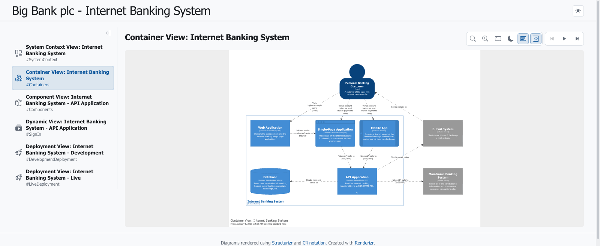

# Renderizr

[](https://github.com/FormulaMonks/renderizr/actions/workflows/ci.yml) [](https://nodejs.org) [](LICENSE)

Render a [Structurizr](https://structurizr.com/) workspace — its diagrams, documentation and architecture decisions — as a static site, or as a single self-contained HTML file you can host anywhere.

```bash
npx github:FormulaMonks/renderizr https://raw.githubusercontent.com/structurizr/ui/main/examples/big-bank-plc.json
```

That renders the [Big Bank plc example](https://structurizr.com/dsl?example=big-bank-plc) into `./structurizr-output` — a couple of seconds, once npm has fetched the package. Serve it with anything:

```bash
npx servor structurizr-output
```

And you get this:

<!--
  A live, clickable copy of exactly this build belongs here, in place of (or beside) the screenshot:

    https://formulamonks.github.io/renderizr/                 the browsable site
    https://formulamonks.github.io/renderizr/single-file.html the same workspace as one document

  .github/workflows/pages.yml publishes both on every push to main, but no deployment has happened yet and one manual step stands in the way: an admin has to flip Settings → Pages → Source = "GitHub Actions" once, because creating a Pages site needs administration:write and GITHUB_TOKEN cannot hold it. Until then `gh api repos/FormulaMonks/renderizr/pages` returns 404, the workflow's preflight job skips the build and deploy jobs rather than failing — the run reports success, having published nothing — and these links would 404 in the first screenful. Add them in the same pull request as the first green pages deployment, not before. Tracked in MAINTAINERS.md → "Repository setup still to be done". -->

<picture>
  <source media="(prefers-color-scheme: dark)" srcset="docs/screenshot-dark.png">
  
</picture>

You need Node 20 or newer. Nothing else — no JVM, no Docker, no Graphviz, no PlantUML, nothing to install first.

## Who this is for

You keep a C4 model in Structurizr, and you want everyone else to be able to look at it without an account, a running server or a copy of the DSL. Renderizr takes the workspace JSON you already have and turns it into pages you can put behind a URL: the views, the workspace documentation and the decision log, with the diagrams drawn by Structurizr's own renderer so they look exactly as they do in Structurizr Lite.

It renders a workspace. It does not define one — the model, the views and the styles all come from your workspace, unchanged.

## What you get

- **Every view**, listed down the side: landscape, context, container, component, dynamic, deployment, image, filtered and custom — each with its own mark and key.
- **The real Structurizr renderer**, vendored from [structurizr/structurizr](https://github.com/structurizr/structurizr), not a PlantUML export. Diagrams pan and zoom, dynamic views play back, labels toggle.
- **Workspace documentation** as pages, with a table of contents and heading anchors. Markdown gets GitHub-style alerts, permalinks and highlighting; AsciiDoc is converted, not dumped as `:toc:` noise.
- **The decision log**: status pills, supersessions and amendments, grouped by year, headed by how many are recorded and how many still stand.
- **Light and dark**, following the reader's system setting until they override it. Page and diagrams keep separate preferences.
- **Deep links that survive**: routing lives in the URL hash, so a link to a view, document or decision still works after a reload, over `file://`, and inside a sandboxed frame.

Documentation and decisions are read from the workspace level (`documentation.sections` and `documentation.decisions`). Sections attached to an individual software system or container are not rendered as pages.

## Single file

`--single-file` inlines every stylesheet, script, font, icon and the workspace itself into one document with no network requests at all:

```bash
npx github:FormulaMonks/renderizr ./workspace.json --single-file
```

You get two files:

| File | Use it for |
| --- | --- |
| `index.html` | Anywhere a URL can point: GitHub Pages, S3, an email attachment, or straight off your disk over `file://` |
| `artifact.html` | Hosts that supply their own document scaffolding, such as a Claude artifact — same page, no `<html>`/`<head>`/`<body>` of its own |

The Big Bank example comes out at about 1MB, or 325KB gzipped — renderer, icons and workspace included. Multi-file builds emit `index.html`, an `assets/` folder and a favicon instead, with relative URLs, so they can sit in any subdirectory.

This mode exists because a directory of files is not always something you can hand over. A single file goes in a chat message, an email, a wiki attachment or an S3 bucket with no build step. It opens off a USB stick on a machine with no network, and it survives being copied somewhere nobody remembers to point a static server at.

Themes, element icons and a logo referenced by URL are all fetched during the build and folded in. The rendered page never reaches for the network, which is also what makes it work under a strict content security policy.

## Options

```bash
npx github:FormulaMonks/renderizr ./workspace.json \
  --single-file \
  --logo ./logo.svg \
  --font "Inter"
```

The one required argument is the workspace: a local path or an `http(s)` URL to a Structurizr workspace **JSON** file. Everything else is optional.

| Flag | Effect |
| --- | --- |
| `-o, --out <dir>` | Output directory, relative to the current directory. Default `structurizr-output`. It is emptied before the build |
| `--single-file` | Emit one self-contained `index.html` with every asset inlined, plus `artifact.html` |
| `--base <path>` | Base public path for the multi-file build. Default is empty, which emits relative URLs (`./assets/…`) that work from any subdirectory. Set it to something like `/renderizr/` when the assets must be referenced absolutely |
| `--logo <path\|url>` | Image shown at the top left of the header. Fetched at build time, minified if it is SVG, and embedded as a data URI. PNG, JPEG, GIF, WebP and SVG are recognised from their bytes rather than their extension; an SVG containing script is rejected |
| `--logo-alt <text>` | Alt text for the logo. Default empty |
| `--logo-href <url>` | Wraps the logo in a link |
| `--font <family>` | A [Google Web Font](https://fonts.google.com) family, e.g. `Inter` or `"Source Sans 3"`. Downloaded as woff2 at build time and embedded, including into the diagram labels |
| `--font-weights <list>` | Comma-separated weights. Default `400,700`. A variable font covering the range is preferred when the family has one |
| `--font-subsets <list>` | Comma-separated subsets. Default `latin` |
| `--font-italic` | Also embed the italic faces, which roughly doubles the font's contribution |
| `-h, --help` | Print this reference as text and exit |

A font is the one option with a real cost: Inter at latin, weights 400–700, adds about 50KB gzipped. Everything else is a few kilobytes at most.

## Renderizr or structurizr-site-generatr?

[structurizr-site-generatr](https://github.com/avisi-cloud/structurizr-site-generatr) solves the same problem and solves parts of it better. The two make opposite trades, so the choice is usually clear:

| | Renderizr | structurizr-site-generatr |
| --- | --- | --- |
| Runtime | Node ≥ 20, one `npx` invocation | A JVM, installed via Homebrew or a tarball — or Docker instead |
| Input | Workspace JSON | Structurizr DSL, parsed by the official parser — including straight from a git repository |
| Diagrams | Structurizr's own browser renderer: pan, zoom, dynamic-view playback | PlantUML export to SVG, PNG and `.puml`, downloadable as files |
| Output shape | One page, hash routing — or one file | A page per view and per software system, crawlable and linkable |
| Documentation and ADRs | Workspace level | Workspace level *and* per software system |
| Full-text search | No | Yes, a Lunr index over the whole site |
| Multiple branches | No | Yes, several branches of the model side by side |
| Network at runtime | None. Every asset is inlined or local | Browser dependencies come from a CDN by default |
| Styling | Your workspace's own styles and themes, plus a logo and a font | Site colours, favicon and a custom stylesheet, configured as view properties in the model |

Reach for **structurizr-site-generatr** when you want a browsable documentation site — search, one URL per system, several branches published together, per-system docs — and a JVM or Docker in the pipeline is not a problem.

Reach for **Renderizr** when you want the workspace to *look like Structurizr* and to travel: a live renderer rather than exported images, no toolchain beyond Node, and an output you can attach to a message or drop into a bucket. If you keep your model in DSL, get the JSON first — [Structurizr Lite](https://docs.structurizr.com/lite) writes `workspace.json` next to your `workspace.dsl` every time it loads the model — and hand that to Renderizr.

## Requirements

- **Node 20 or newer.** The build checks this before anything else and stops with a clear message, because `npx` runs against whatever Node is first on the `PATH` — often not the one your shell reports.
- **A workspace in JSON.** [Structurizr Lite](https://docs.structurizr.com/lite) writes one next to your DSL; the Structurizr [server API](https://docs.structurizr.com/commands) hands one back. Renderizr does not parse DSL.
- **Network access at build time** only if the workspace, the logo or the font is remote, or if the workspace references themes or icons by URL. The rendered output never needs it.

---

## Local development

### Setup

```bash
pnpm install
pnpm hooks   # once, to install the git hooks
```

Installing the hooks is a separate step rather than a `prepare` script: `prepare` runs when a package is installed from a git URL, and `npx github:FormulaMonks/renderizr` is exactly that — so a `prepare` script here would try to run husky inside every consumer's install tree. Contributors are the only people who want the hooks.

The Structurizr submodule is optional — the files the build reads from it are committed under `vendor/structurizr`. Check it out only to pull in a newer upstream:

```bash
git submodule update --init --remote submodules/structurizr
pnpm sync:vendor
```

### Dev server

```bash
pnpm dev                                # this repo's own architecture/workspace.json
pnpm dev -- {path/to/workspace.json}    # any other one
```

Vite serves it on <http://localhost:5173> with hot reload for `src/`. The `--` is required. Without it Vite claims the path as its own project root and still starts — printing `Could not auto-determine entry point` and then serving an empty page, which is a slower way to find out you got it wrong. Flags such as `--font` and `--logo` go **before** the workspace path; [CONTRIBUTING.md](CONTRIBUTING.md#dev-server) explains why.

### Build locally

```bash
pnpm build {path/to/workspace.json} [--single-file] [--logo ...] [--font ...]
# Outputs to ./structurizr-output/
```

No `--` on this one, and it matters: `node:util`'s `parseArgs` treats everything after `--` as a positional, so `pnpm build -- ws.json --single-file` arrives as two workspaces and exits 1 with `Expected one workspace, got 2`. `pnpm build` type-checks first; `node scripts/build.js …` skips that and is what `npx` runs.

### Checks

```bash
pnpm test                  # node:test, over scripts/*.test.js and test/*.test.js
pnpm exec tsc --noEmit     # type-check
pnpm exec biome ci .       # lint and format
```

`scripts/*.test.js` covers the build pipeline; `test/*.test.js` covers the app in `src/`, against a small purpose-built DOM in `test/support/`. [CONTRIBUTING.md](CONTRIBUTING.md#adding-a-test) says which directory a new test belongs in.

### How the build is put together

| File | Responsibility |
| --- | --- |
| `scripts/build.js` | CLI entry point — parses arguments, loads the workspace and assets, runs the build |
| `scripts/cli.js` | Argument definitions and `--help` |
| `scripts/assets.js` | Fetching and embedding the workspace, themes, icons, logo and font |
| `scripts/config.js` | The Vite configuration, shared with the dev server |
| `scripts/plugins.js` | Build plugins: Structurizr globals, CSS trimming, branding injection, single-file inlining |
| `scripts/escapes.js` | Rewrites the escape sequences a Claude artifact upload rejects, and fails the build if any survive |
| `scripts/sync-vendor.js` | Copies the files the build reads out of the submodule into `vendor/structurizr` |
| `vite.config.ts` | Dev server only; production goes through `scripts/build.js` |

Diagrams are drawn by Structurizr's own renderer, taken from [structurizr/structurizr](https://github.com/structurizr/structurizr) — the same code the official local server serves, so a workspace renders here exactly as it does there. The renderer, its stylesheet and the icons live in `vendor/structurizr`, copied verbatim from the submodule and committed: neither npm nor pnpm fetches submodules for a git dependency, so an `npx` install would otherwise arrive with nothing to render with. `pnpm sync:vendor` refreshes them, taking exactly the files the source imports. `src/structurizr-globals.ts` supplies the handful of globals it expects, and `scripts/plugins.js` concatenates and injects it as a classic script (the renderer is written for sloppy mode, which an ES module forbids; an inline script is not `eval`, so a strict CSP still passes). The comments in both explain the details.

## Contributing

Bug reports, feature requests and pull requests are all welcome. [CONTRIBUTING.md](CONTRIBUTING.md) has the workflow, the commit convention and what a reviewable change looks like; [SUPPORT.md](SUPPORT.md) says where each kind of question goes and what makes one answerable. Questions are fine as issues — the [issue tracker](https://github.com/FormulaMonks/renderizr/issues) is the place to ask.

Please do not open a public issue for a security problem. Report it privately through [GitHub Security Advisories](https://github.com/FormulaMonks/renderizr/security/advisories/new); [SECURITY.md](SECURITY.md) has the response timeline.

## License

MIT — see [LICENSE](LICENSE). Copyright (c) 2024-2026 Formula.Monks.

Renderizr vendors, bundles and inlines a fair amount of code it did not write — the Structurizr renderer under `vendor/structurizr` (Apache 2.0), [Bootstrap Icons](https://icons.getbootstrap.com) (MIT), and the libraries that end up inside every rendered page. [THIRD-PARTY-NOTICES.md](THIRD-PARTY-NOTICES.md) lists each one with its version, licence and copyright line, and says whether it ships in the output or only runs during the build. [NOTICE](NOTICE) is the short form.
