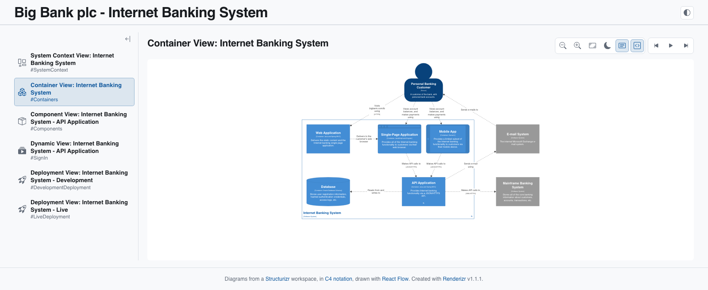

# Renderizr

[](https://github.com/FormulaMonks/renderizr/actions/workflows/ci.yml) [](https://nodejs.org) [](LICENSE)

Render a [Structurizr](https://structurizr.com/) workspace — its diagrams, documentation and architecture decisions — as a static site, or as a single self-contained HTML file you can host anywhere.

```bash
npx github:FormulaMonks/renderizr https://raw.githubusercontent.com/structurizr/ui/main/examples/big-bank-plc.json
```

That renders the [Big Bank plc example](https://structurizr.com/dsl?example=big-bank-plc) into `./structurizr-output` — a couple of seconds, once npm has fetched the package. Serve it with anything:

```bash
npx servor structurizr-output
```

And you get this:

<!--
  A live, clickable copy of exactly this build belongs here, in place of (or beside) the screenshot:

    https://formulamonks.github.io/renderizr/                 the browsable site
    https://formulamonks.github.io/renderizr/single-file.html the same workspace as one document

  .github/workflows/pages.yml publishes both on every push to main, but no deployment has happened yet and one manual step stands in the way: an admin has to flip Settings → Pages → Source = "GitHub Actions" once, because creating a Pages site needs administration:write and GITHUB_TOKEN cannot hold it. Until then `gh api repos/FormulaMonks/renderizr/pages` returns 404, the workflow's preflight job skips the build and deploy jobs rather than failing — the run reports success, having published nothing — and these links would 404 in the first screenful. Add them in the same pull request as the first green pages deployment, not before. Tracked in MAINTAINERS.md → "Repository setup still to be done". -->

<picture>
  <source media="(prefers-color-scheme: dark)" srcset="docs/screenshot-dark.png">
  
</picture>

You need Node 20 or newer. Nothing else — no JVM, no Docker, no Graphviz, no PlantUML, nothing to install first.

## Who this is for

You keep a C4 model in Structurizr, and you want everyone else to be able to look at it without an account, a running server or a copy of the DSL. Renderizr takes the workspace JSON you already have and turns it into pages you can put behind a URL: the views, the workspace documentation and the decision log, with the diagrams drawn by Renderizr's own engine from everything the workspace says: positions, styles, themes, shapes and routing. They read the way they do in Structurizr, with real text wrapping and embedded fonts, but they aren't pixel copies.

It renders a workspace. It does not define one — the model, the views and the styles all come from your workspace, unchanged.

## What you get

- **Every view**, listed down the side: landscape, context, container, component, dynamic, deployment, image, filtered and custom — each with its own mark and key.
- **A live diagram engine** built for workspace JSON, not a PlantUML export. Diagrams pan and zoom, dynamic views animate, labels toggle, and an element with several destinations offers a choice.
- **Workspace documentation** as pages, with a table of contents and heading anchors. Heading ids match GitHub's, and relative links between documentation files and decisions (`02-containers.md#api`, `../decisions/0005-foo.md`) open the matching page; Renderizr shows a link to a file the workspace doesn't include as plain text. Markdown gets GitHub-style alerts, permalinks and highlighting; AsciiDoc is converted, not dumped as `:toc:` noise.
- **The decision log**: status pills, supersessions and amendments, grouped by year, headed by how many are recorded and how many still stand.
- **Light and dark**, following the reader's system setting until they override it. Page and diagrams keep separate preferences.
- **Deep links that survive**: routing lives in the URL hash, so a link to a view, document or decision still works after a reload, over `file://`, and inside a sandboxed frame.

Renderizr reads documentation and decisions from the workspace level (`documentation.sections` and `documentation.decisions`). It does not render sections attached to an individual software system or container as pages.

## Single file

`--single-file` inlines every stylesheet, script, font, icon and the workspace itself into one document with no network requests at all:

```bash
npx github:FormulaMonks/renderizr ./workspace.json --single-file
```

You get two files:

| File | Use it for |
| --- | --- |
| `index.html` | Anywhere a URL can point: GitHub Pages, S3, an email attachment, or straight off your disk over `file://` |
| `artifact.html` | Hosts that supply their own document scaffolding, such as a Claude artifact — same page, no `<html>`/`<head>`/`<body>` of its own |

The Big Bank example comes out at about 920KB, or 300KB gzipped, with the engine, icons and workspace included. Multi-file builds emit `index.html`, an `assets/` folder and a favicon instead, with relative URLs, so they can sit in any subdirectory.

This mode exists because a directory of files is not always something you can hand over. A single file goes in a chat message, an email, a wiki attachment or an S3 bucket with no build step. It opens off a USB stick on a machine with no network, and it survives being copied somewhere nobody remembers to point a static server at.

The build fetches themes, element icons and a logo referenced by URL, and folds them all in. The rendered page never reaches for the network, which is also what makes it work under a strict content security policy.

## Options

```bash
npx github:FormulaMonks/renderizr ./workspace.json \
  --single-file \
  --logo ./logo.svg \
  --font "Inter"
```

The one required argument is the workspace: a local path or an `http(s)` URL to a Structurizr workspace **JSON** file. Everything else is optional.

| Flag | Effect |
| --- | --- |
| `-o, --out <dir>` | Output directory, relative to the current directory. Default `structurizr-output`. The build empties it first |
| `--single-file` | Emit one self-contained `index.html` with every asset inlined, plus `artifact.html` |
| `--base <path>` | Base public path for the multi-file build. Default is empty, which emits relative URLs (`./assets/…`) that work from any subdirectory. Set it to something like `/renderizr/` when the assets must be referenced absolutely |
| `--logo <path\|url>` | Image shown at the top left of the header. The build fetches it, minifies it if it is SVG, and embeds it as a data URI. It recognizes PNG, JPEG, GIF, WebP and SVG from their bytes rather than their extension, and rejects an SVG containing script |
| `--logo-alt <text>` | Alt text for the logo. Default empty |
| `--logo-href <url>` | Wraps the logo in a link |
| `--font <family>` | A [Google Web Font](https://fonts.google.com) family, e.g. `Inter` or `"Source Sans 3"`. The build downloads it as woff2 and embeds it, including into the diagram labels |
| `--font-weights <list>` | Comma-separated weights. Default `400,700`. The build prefers a variable font covering the range when the family has one |
| `--font-subsets <list>` | Comma-separated subsets. Default `latin` |
| `--font-italic` | Also embed the italic faces, which roughly doubles the font's contribution |
| `--primary-color <color>` | A CSS color, such as `#e4572e` or `rgb(228 87 46)`, for links, the active page and view, and edit mode's marks, in light and dark alike. Default is Renderizr's blue |
| `-h, --help` | Print this reference as text and exit |

A font is the one option with a real cost: Inter at latin, weights 400–700, adds about 50KB gzipped. Everything else is a few kilobytes at most.

## Edit mode

Edit mode lets you arrange the layout of a workspace's views in a browser, with the editing features of Structurizr Local's diagram editor, and saves that layout into `workspace.json`. It changes layout only: element positions, vertices, routing modes, label positions and the canvas. You keep writing the model, styles, documentation and decisions in the DSL or the JSON. Builds stay read-only and never need any of this.

```bash
npx github:FormulaMonks/renderizr edit ./architecture
```

`renderizr edit [path]` takes a `workspace.dsl`, a `workspace.json` or a folder, and opens the current folder when you leave the path out. A file path can carry any name; in a folder, edit mode looks only for the exact names `workspace.dsl` and `workspace.json`, and never in subfolders. It starts a local server and keeps running until you press Ctrl+C. The terminal prints the URL: open it in your browser, and use it again to come back to the editor. With `--open`, edit mode opens it for you.

| You open | Edit mode runs | It saves into |
| --- | --- | --- |
| A `workspace.dsl`, or a folder holding one, with Structurizr's tools set up | A DSL session: Structurizr's tools read the DSL, and the page updates whenever a file in the DSL's folder changes | The `workspace.json` beside the DSL |
| A `workspace.dsl`, or a folder holding one, without the tools but with a `workspace.json` beside it | A JSON session on that `workspace.json`. The terminal says so, and warns when the DSL changed after the JSON | That `workspace.json` |
| A `workspace.dsl`, or a folder holding one, without the tools and without a `workspace.json` | Nothing: it stops before the server starts and says how to set the tools up | Nothing |
| A `workspace.json`, or a folder holding only one | A JSON session, with no tools and no JVM | That `workspace.json`, in place |

On a view you can edit, the toolbar shows a pencil. Two buttons take you back to reading: **Save and close** (the check mark) saves what waits, and **Discard changes and close** (the cross) puts every view back as it was when you entered editing, saves that and closes. A view with automatic layout shows the pencil disabled, since its layout comes from `autoLayout` in the DSL. A filtered view links to its base view, and an image view has nothing to edit. A view with no stored layout yet opens with the positions Renderizr would draw, and your first edit saves them.

Edit mode saves 5 seconds after your last change, and at once on Cmd/Ctrl+S. A dot in the toolbar shows where saving stands: yellow while changes wait, gray and pulsing while a save is on its way, green once saved and red when a save failed. Its tooltip says why a save failed.

### Flags

`renderizr edit` takes the branding flags of the build (`--logo`, `--logo-alt`, `--logo-href`, `--font`, `--font-weights`, `--font-subsets`, `--font-italic`, `--primary-color`), so the editor looks like your site, plus two of its own:

| Flag | Effect |
| --- | --- |
| `--port <n>` | Port for the local server. Default `7341`, or the next free one when that one is taken |
| `--open` | Also open the URL in your browser. Without it, edit mode only prints the URL |

It refuses `--out`, `--single-file`, `--base` and `--engine`: edit mode writes no output and always draws with the React Flow engine. `renderizr edit --help` lists the flags.

The server listens on `127.0.0.1` only, so nothing but your machine reaches it, and every save carries a token that only the URL the terminal printed holds.

### Structurizr's tools for a DSL session

Renderizr never parses DSL. A DSL session runs Structurizr's own tools: `merge -workspace workspace.dsl -layout workspace.json`, which lays the saved layout over the model, as Structurizr Local does, or `export` on the first run, while there is no `workspace.json` yet. Edit mode finds the tools in this order:

1. The `STRUCTURIZR_CLI` environment variable, read as a whole command.
2. `structurizr-cli` on your `PATH`.

The tools need Java 21 to 25. Groovy `!script` blocks fail on Java 26. Edit mode works with the 2026 distribution (`structurizr.war` and the `structurizr/structurizr` Docker image, where every tool is a subcommand) and with the archived `structurizr-cli` 2025.11.09.

```bash
# The war, run with a Java 21 to 25
STRUCTURIZR_CLI="java -jar ~/bin/structurizr.war" npx github:FormulaMonks/renderizr edit ./architecture

# Docker, with no Java on your machine
STRUCTURIZR_CLI='docker run --rm -v "$PWD:/usr/local/structurizr" structurizr/structurizr' npx github:FormulaMonks/renderizr edit ./architecture
```

Edit mode runs the command through the shell from the DSL's folder, so `$PWD` in single quotes expands there and the container mounts that folder. The tools write into a temporary `.renderizr-*` folder beside the DSL, which edit mode deletes after each run, and never write `workspace.json` themselves.

When a DSL change breaks the parse, the terminal prints the tools' output and the page shows the error over the last workspace that parsed, which stays editable. The next good run clears it.

Two things come from Structurizr and stay as Structurizr has them:

- **The id fallback.** `merge` carries each element's position over by its canonical name and falls back to its id. When a DSL change renames an element and shifts the ids of others, `merge` can hand the renamed element another element's position. Check the views after a rename.
- **Unwatched includes.** Edit mode watches every file under the DSL's folder, except `workspace.json`, dot folders and `node_modules`. A file that `!include` pulls in from outside that folder goes unwatched, as in Structurizr Local: save a file inside the folder to run the tools again.

### Keys

Keys match by physical key, so Option's characters on macOS don't get in the way. `?` opens the same list in the editor.

| Command | Keys |
| --- | --- |
| Align left, horizontal centers, right | Alt+A, Alt+H, Alt+D |
| Align top, vertical centers, bottom | Alt+W, Alt+V, Alt+S |
| Distribute horizontally, vertically | Alt+Shift+H, Alt+Shift+V |
| Cycle routing modes for selected relationship | Alt+R |
| Nudge the selection by 5, by 50 | Arrow keys, Shift+arrow keys |
| Pan, with nothing selected | Arrow keys |
| Select every element in the view | Cmd/Ctrl+A |
| Close a menu, then clear the selection or the selected edge, then end the animation | Escape |
| Add the focused element to the selection, or take it out | A tap on Space (holding Space while dragging pans) |
| Open the focused item's activation targets | Enter |
| Walk the focus order | Tab |
| Zoom in, zoom out, fit the diagram | `+`, `-`, `0` |
| Undo | Cmd/Ctrl+Z |
| Redo | Cmd/Ctrl+Shift+Z, and Ctrl+Y on Windows and Linux |
| Save now | Cmd/Ctrl+S |
| Open the keyboard shortcuts | `?` |

With the pointer, a drag moves an element or the selection, and a drag on empty canvas draws a marquee. A double-click on an edge adds a vertex, and a double-click on a vertex removes it. A selected edge shows a handle on each edge end: drag one onto a side of its element to choose that side. A drag on an edge's label slides it along the route. The edit toolbar also holds the routing mode of the selected edge, which Alt+R cycles too, the canvas size (Decrease, Increase and Auto) and **Calculate layout**, which lays out the whole view once, the way an automatic layout would, and stores the result as the view's layout. Undo covers all of it.

### What edit mode writes

Edit mode saves only fields Structurizr defines, the way Structurizr Local saves them, so Structurizr reads the file back unchanged:

- Element `x` and `y`; relationship `vertices`, `routing` and `position`; view `dimensions`. It deletes `paperSize` when you change the canvas size, and keeps a stored `jump` as it found it.
- The stamps Structurizr Local writes: `lastModifiedDate`, `lastModifiedAgent` (`renderizr/<version>`), the workspace `id` (`1` when the file has none) and `views.configuration.lastSavedView`. It keeps `lastModifiedUser` when present.
- The first edit of a view stores `x` and `y` for every element in it, so the view looks the same after a reload. An element you place at exactly (0,0) goes to (5,0), since Renderizr reads (0,0) as unplaced.

It writes the file the way Structurizr does: a Structurizr read followed by a Structurizr write. It drops keys Structurizr doesn't define, keeps only `scope` in the workspace `configuration`, truncates fractions and keeps the line endings the file has. In a DSL session the file holds what `merge` writes, so it loses what structurizr-java 5 no longer writes, such as `model.enterprise` and element `location`. Edit mode writes only when the content changes, so opening a workspace and looking at it writes nothing.

### Vertices turn avoidance off

An edge without vertices goes round the elements in its way. Any vertex turns that off for its relationship, and choosing a side adds a vertex: an edge that used to bend round elements runs straight through them once you choose a side. Add vertices to route it round them again.

An edge with vertices also keeps each edge end where its nearest vertex aims it, and those ends no longer spread along the side with the ends of other edges. Reading mode and builds draw them the same way.

## Use it from an AI agent

Renderizr ships an agent skill, so a coding agent can render a workspace for you without you telling it how each time:

```bash
npx skills add formulamonks/renderizr
```

It teaches the agent the one command, which of the two `--single-file` outputs to hand over, how to get JSON out of a DSL workspace, and how to check the result is genuinely self-contained before passing it on. Ask for "an artifact of the architecture" and you get one back.

It pairs with [Scaffoldizr](https://formulamonks.github.io/scaffoldizr/), whose skill authors a workspace where this one renders it — `npx skills add formulamonks/scaffoldizr`. The skill lives in [`.agents/skills/renderizr`](.agents/skills/renderizr) if you would rather read it than install it.

## Renderizr or structurizr-site-generatr?

[structurizr-site-generatr](https://github.com/avisi-cloud/structurizr-site-generatr) solves the same problem and solves parts of it better. The two make opposite trades, so the choice is usually clear:

| | Renderizr | structurizr-site-generatr |
| --- | --- | --- |
| Runtime | Node ≥ 20, one `npx` invocation | A JVM, installed via Homebrew or a tarball — or Docker instead |
| Input | Workspace JSON | Structurizr DSL, parsed by the official parser — including straight from a git repository |
| Diagrams | Renderizr's own browser engine, which honors Structurizr's layout and styles: pan, zoom, dynamic-view animation | PlantUML export to SVG, PNG and `.puml`, downloadable as files |
| Output shape | One page, hash routing — or one file | A page per view and per software system, crawlable and linkable |
| Documentation and ADRs | Workspace level | Workspace level *and* per software system |
| Full-text search | No | Yes, a Lunr index over the whole site |
| Multiple branches | No | Yes, several branches of the model side by side |
| Network at runtime | None. Every asset is inlined or local | Browser dependencies come from a CDN by default |
| Styling | Your workspace's own styles and themes, plus a logo and a font | Site colors, favicon and a custom stylesheet, configured as view properties in the model |

Reach for **structurizr-site-generatr** when you want a browsable documentation site — search, one URL per system, several branches published together, per-system docs — and a JVM or Docker in the pipeline is not a problem.

Reach for **Renderizr** when you want the workspace to keep the layout and styling you gave it in Structurizr and to travel: a live engine rather than exported images, no toolchain beyond Node, and an output you can attach to a message or drop into a bucket. If you keep your model in DSL, get the JSON first: [structurizr-cli](https://docs.structurizr.com/cli) exports a DSL workspace to JSON — and hand that to Renderizr.

## Requirements

- **Node 20 or newer.** The build checks this before anything else and stops with a clear message, because `npx` runs against whatever Node is first on the `PATH` — often not the one your shell reports.
- **A workspace in JSON.** [structurizr-cli](https://docs.structurizr.com/cli) exports one from your DSL; the Structurizr [server API](https://docs.structurizr.com/commands) hands one back. Renderizr does not parse DSL.
- **Structurizr's tools and Java 21 to 25, or Docker,** only for [edit mode](#edit-mode) on a `workspace.dsl`. Builds and edit mode on a `workspace.json` need neither.
- **Network access at build time** only if the workspace, the logo or the font is remote, or if the workspace references themes or icons by URL. The rendered output never needs it.

---

## Local development

### Setup

```bash
pnpm install
pnpm hooks   # once, to install the git hooks
```

Installing the hooks is a separate step rather than a `prepare` script: `prepare` runs when a package manager installs a package from a git URL, and `npx github:FormulaMonks/renderizr` is exactly that — so a `prepare` script here would try to run husky inside every consumer's install tree. Contributors are the only people who want the hooks.

For the same reason the script that renders a workspace is `render`. npm prepares a git dependency with a full `npm install --include dev` whenever its `package.json` has a `build`, `prepare`, `prepack`, `install`, `preinstall` or `postinstall` script, and that adds about 20 seconds to a cold `npx`. `scripts/install.test.js` fails if one of those names comes back.

The Structurizr submodule is optional: only the acceptance tests read workspaces from it, and they skip those workspaces when it is absent. `.gitmodules` keeps it out of recursive clones, so `npx` never downloads it. Check it out to run the acceptance tests:

```bash
git submodule update --init --checkout submodules/structurizr
```

### Dev server

```bash
pnpm dev                                # this repo's own architecture/workspace.json
pnpm dev -- {path/to/workspace.json}    # any other one
```

Vite serves it on <http://localhost:5173> with hot reload for `src/`. The `--` is required. Without it Vite claims the path as its own project root and still starts — printing `Could not auto-determine entry point` and then serving an empty page, which is a slower way to find out you got it wrong. Flags such as `--font` and `--logo` go **before** the workspace path; [CONTRIBUTING.md](CONTRIBUTING.md#dev-server) explains why.

### Build locally

```bash
pnpm render {path/to/workspace.json} [--single-file] [--logo ...] [--font ...]
# Outputs to ./structurizr-output/
```

No `--` on this one, and it matters: `node:util`'s `parseArgs` treats everything after `--` as a positional, so `pnpm render -- ws.json --single-file` arrives as two workspaces and exits 1 with `Expected one workspace, got 2`. `pnpm render` type-checks first; `node scripts/build.js …` skips that and is what `npx` runs.

### Checks

```bash
pnpm test                  # node:test, over scripts/*.test.js and test/*.test.js
pnpm exec tsc --noEmit     # type-check
pnpm exec biome ci .       # lint and format
```

`scripts/*.test.js` covers the build pipeline; `test/*.test.js` covers the app in `src/`, against a small purpose-built DOM in `test/support/`. [CONTRIBUTING.md](CONTRIBUTING.md#adding-a-test) says which directory a new test belongs in.

### How the build is put together

| File | Responsibility |
| --- | --- |
| `scripts/build.js` | CLI entry point — parses arguments, loads the workspace and assets, runs the build |
| `scripts/cli.js` | Argument definitions and `--help`, for the build and for `renderizr edit` |
| `scripts/edit.js`, `scripts/edit-plugin.js` | Edit mode: the session a path opens, the local server and its save endpoint |
| `scripts/dsl-pipeline.js`, `scripts/structurizr-tools.js` | Running Structurizr's tools on a `workspace.dsl` in edit mode |
| `scripts/workspace-writer.js`, `scripts/structurizr-schema.js` | Writing `workspace.json` the way Structurizr does |
| `scripts/assets.js` | Fetching and embedding the workspace, themes, icons, logo and font |
| `scripts/config.js` | The Vite configuration, shared with the dev server |
| `scripts/plugins.js` | Build plugins: branding injection and single-file inlining |
| `scripts/escapes.js` | Rewrites the escape sequences a Claude artifact upload rejects, and fails the build if any survive |
| `vite.config.ts` | Dev server only; production goes through `scripts/build.js` |

The page draws diagrams with Renderizr's own engine, in `src/engine/`. The model layer in `src/model/` reads the workspace: a typed port of Structurizr's workspace model and style resolution, and `resolveView`, which turns any view key into a concrete view. `src/engine/geometry/` and `src/engine/layout/` are plain functions over that view (boundaries, shapes, unplaced elements, routes, and Dagre for automatic layout). The island in `src/engine/react-flow/` is a React root built on [React Flow](https://reactflow.dev) that draws the result inside the diagram target and nowhere else, and `src/engine/index.ts` is the only way in: `mountEngine` and the `Engine` it returns. The rest of the page stays plain TypeScript.

## Contributing

Bug reports, feature requests and pull requests are all welcome. [CONTRIBUTING.md](CONTRIBUTING.md) has the workflow, the commit convention and what a reviewable change looks like; [SUPPORT.md](SUPPORT.md) says where each kind of question goes and what makes one answerable. Questions are fine as issues — the [issue tracker](https://github.com/FormulaMonks/renderizr/issues) is the place to ask.

Please do not open a public issue for a security problem. Report it privately through [GitHub Security Advisories](https://github.com/FormulaMonks/renderizr/security/advisories/new); [SECURITY.md](SECURITY.md) has the response timeline.

## License

MIT — see [LICENSE](LICENSE). Copyright (c) 2024-2026 Formula.Monks.

Renderizr bundles and inlines a fair amount of code it did not write: React and React Flow (MIT), Dagre (MIT), [Bootstrap Icons](https://icons.getbootstrap.com) (MIT) and the other libraries that end up inside every rendered page. Its model layer derives from Structurizr's own code (Apache 2.0). [THIRD-PARTY-NOTICES.md](THIRD-PARTY-NOTICES.md) lists each one with its version, license and copyright line, and says whether it ships in the output or only runs during the build. [NOTICE](NOTICE) is the short form.
